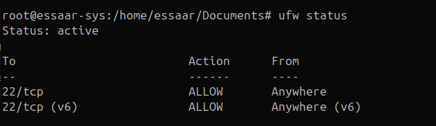
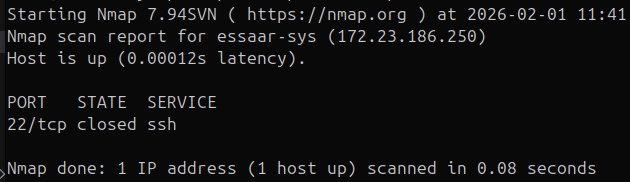

# PART A — HOME FIREWALL LAB
## LAB GOAL
### Simulate how firewalls are used in SOC environments:

- Baseline hardening
- Traffic inspection
- Attack simulation
- Log analysis
- Incident-style response

**You will not break your system if you follow the order.**

## Lab Setup
### 1. Identify your network
`ip a` `ip route`
**NOTE:** interface name: wlp3s0 (my pc's), eth0 and local IP: 172.23.186.79
### 2. Installing required tools
`apt install nmap net-tools iptables iptables-persistent ufw`

# Lab 1: Baseline hardening (SOC's Step 1)
**OBJECTIVE:** create a secure default posture like production systems.

*Baseline hardening means the proactive process to protect/secure IT Systems (servers, workstations, network devices etc.) by establishing and  setting/applying the standardized, highly secure configuration settings before going into production.*

*It involves closing unnecessary ports, disabling unused services, applying patches, and configuring security settings to reduce the attack surface and mitigate risks like data breaches or ransomware.*

# Steps
`ufw reset`

`ufw default deny incoming`

`ufw default allow outoing`

`ufw default allow ssh`

`ufw enable`

`ufw status verbose`

### Outcome
✔ SOC Skill: System hardening & baseline security

---
# Lab 2: Restrict access by source (Real SOC Scenario)
**Objective** Allow SSH from my machine (Simulates admin-only access)

Finding my ip

`ip addr show`
 
 so wlp3s0 interface my ip is 172.23.186.200/24 (Subnet)

to allow accessing SSH only to trusted person (given ip)

`ufw deny ssh`

`ufw allow from 172.23.186.200/24 to any port 22`

to check `nmap -p 22 172.23.186.200`

**OUTPUT**

|Statement | Meaning|
|-|-|
|Nmap scan report for essaar-sys (172.23.186.200)| stated ip reached to machine *essaar-sys*|
|Host is up (0.00012s latency).| machine reached/visible/online |
|STATE: closed* | reached but connection refused for service SSH|
|Nmap done: 1 IP address (1 host up) scanned in 0.08 seconds| shows that only 1 host is up which is only available|

***CLOSED**: Shows that packet got through network not **FIREWALL**, **FIREWALL** status usually be **FILTERED**"Means packet disappeared in blackhole"  not **CLOSED**

## What does this lab means?
## The Gatekeeper story: How UFW Works?
------

Your computer uses a tool called UFW (Uncomplicated Firewall) to manage incoming and outgoing traffic. Think of it as a security guard at the entrance of a building.

- **The Identity Check (ip addr)**: Before you can tell the guard who to let in, you have to know your own "ID card" number—your IP Address 🆔.
- **The Lockdown (sudo ufw deny ssh)**: This command creates a "default deny" rule. It tells the firewall: "By default, don't let anyone talk to me on Port 22."
- **The Exception (sudo ufw allow from <YOUR-IP> ...)**: This is the core of Access Control. You created a specific rule that says: "If a request comes from exactly this IP address, let them through." 🛡️

**NOTE:** In a real world scenario, attackers scan interent for open SSH ports and try to guess passwords (Brute froce) to enter in. This lab allows only admin's IP/machine to access SSH, means maked SSH **invisible/restrict** from the attackers (rest of the world) even if they know the password. **But here is a **LOCKED OUT** Scenario: Means if IP is changed, then what happens?**
The Short answer for this is: we use OOB (out of Band) Management as a backdoor/like a seperate maintenance door like a serial console or dedicated door. Main firewall rules are not rely on it. Alternative way is use Company issued VPN (which IPs in range are trusted to use).